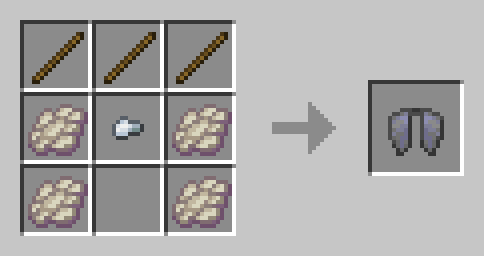
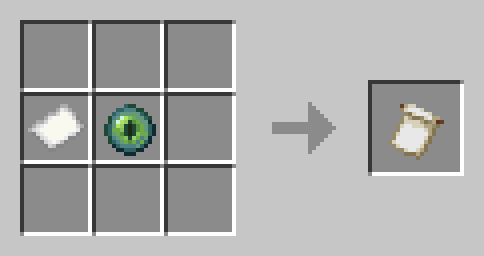
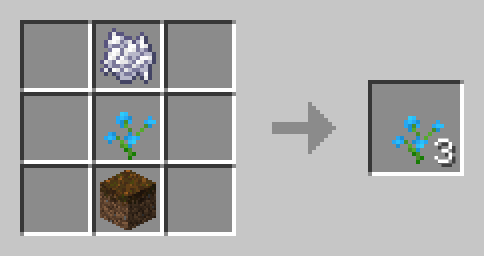
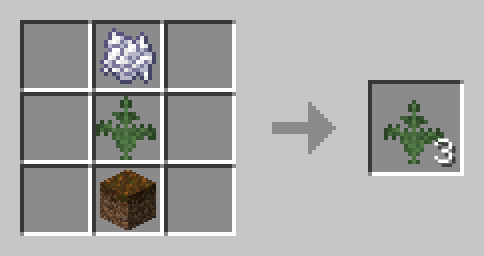
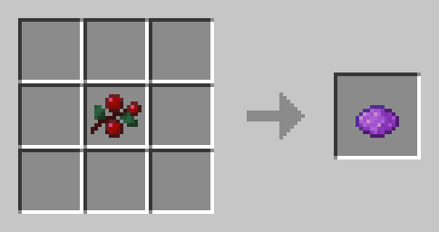
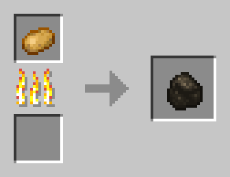
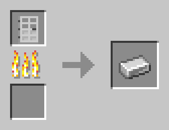

# The Missing Recipes Datapack

A data pack for those of us who feel like there are some missing recipes from Minecraft.

* [Recipes](#recipes)
  * [Crafting](#crafting)
  * [Smelting and Blasting](#smelting--blasting)
  * [Stonecutter](#stonecutter)

## Credits

Created by Jason C. McDonald (CodeMouse92).

Dedicated to Tacoder.

## Purpose

Implements a number of "missing" recipes, as well as more ways to recover materials. Aims to minimize changes in gameplay and game balance, while making it easier to acquire and recover resources.

This is intended to complement my no-monster-minecraft data pack, which contains additional recipes for acquiring hostile mob drops. For best results, I recommend using them together.

## Recipes

### Crafting

#### Bell

Crafted with 3 sticks, 3 gold ingots, and 1 gold nugget.

#### Bleaching

You can use 1 bonemeal to bleach any 1 wool, carpet, bed, or banner to white.

#### Chainmail

Crafted using standard armor shapes, but with chains instead of iron ingots.

#### Cobweb

Crafted from 4 string and 1 slimeball.

#### Elytra

Crafted from 3 sticks, 4 phantom membrane (see Blast Furnace), and 1 iron nugget.

#### Enchanted Golden Apple

Crafted from 8 gold blocks and 1 golden apple.

#### Globe Banner Pattern

Crafted from 1 paper and 1 eye of ender.

#### Knowledge Book

Crafted from 1 book and 1 experience bottle.

In case you don't know what this does: it unlocks all recipes in the game.

#### Leather

Craftable from nine bamboo. (You can still get it from the usual sources.)

#### Name Tag

Crafted from 1 string and 1 paper.

#### Plant Cultivation

You can duplicate many overworld plants using 1 bonemeal and 1 podzol:

* Bamboo
* Flowers
  * Dandelion
  * Poppy
  * Blue Orchid
  * Allium
  * Azure Bluet
  * Red Tulip
  * Orange Tulip
  * Pink Tulip
  * White Tulip
  * Oxeye Daisy
  * Cornflower
  * Lily of the Valley
  * Wither Rose
  * Sunflower
  * Lilac
  * Rose Bush
  * Peony
* Grass
  * Grass
  * Tall Grass
  * Fern
  * Large Fern
* Saplings
  * Oak Sapling
  * Spruce Sapling
  * Birch Sapling
  * Jungle Sapling
  * Acacia Sapling
  * Dark Oak Sapling

It is NOT possible to cultivate crops, mushrooms, aquatic or semi-aquatic plants, cactus, nether plants, or end plants in this way.

#### Purple Dye

Craftable from 1 sweet berries.

#### Red Sand

Crafted from 8 sand and 1 red dye (shapeless).

#### Saddle

Crafted from 4 leather and 2 iron ingots.

#### White Banner/Bed/Carpet/Wool

See "Bleaching".

### Smelting & Blasting

#### Charcoal

Finally, a use for poisonous potatoes! Blasting a potato or poisonous potato in a blast furnace makes charcoal.

This is based on an incident when I was 10, when I accidentally set a potato on fire in the microwave, producing charcoal (and destroying the microwave). Oops!

#### Gold

It is now easier to recover gold from some items.

Smelting or blasting gold horse armor, totem of undying, or a bell now yields
a gold ingot (instead of a gold nugget).

#### Iron

It is now easier to recover iron from some items.

Smelting or blasting an iron door, iron trapdoor, iron horse armor,
or a minecart, hopper, smithing table, or cauldron yields an iron ingot
(instead of an iron nugget).

Smelting or blasting any anvil yields an iron block.

### Stonecutter

You can use the stonecutter to recover some resources.

#### Diamonds

Placing any diamond tool (except a shovel), armor piece, or jukebox on a
stonecutter yields one diamond; diamond horse armor yields three diamonds.

#### Leather

You can also recover one leather from any leather armor on the stonecutter; you can get three leather from leather horse armor or a saddle.

#### Netherite

Placing any netherite tool or armor piece on a stonecutter yields two netherite scrap.

Placing a lodestone on a stonecutter yields one netherite ingot.
