# The Missing Recipes Datapack

A data pack for those of us who feel like there are some missing recipes from Minecraft.

* [Recipes](#recipes)
  * [Crafting](#crafting)
  * [Smelting and Blasting](#smelting--blasting)
  * [Stonecutter](#stonecutter)

## Credits

Created by Jason C. McDonald (CodeMouse92). Some recipes by
Scarecrowman.

Recipe screenshots and some .JSON files created on [https://crafting.thedestruc7i0n.ca/](https://crafting.thedestruc7i0n.ca/)

Dedicated to Tacoder.

## Purpose

Implements a number of "missing" recipes, as well as more ways to recover
materials. Aims to minimize changes in gameplay and game balance, while
making it easier to acquire and recover resources.

This is intended to complement my no-monster-minecraft data pack, which contains
additional recipes for acquiring hostile mob drops. For best results,
I recommend using them together.

## Recipes

### Crafting

#### Bell

Crafted with 2 sticks, 1 string, 3 gold ingots, and 1 gold nugget.

#### Black Dye

Charcoal can be used to create black dye, as in real life.

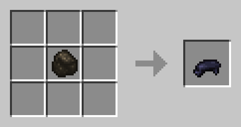

#### Bleaching

You can use 1 bonemeal to bleach any 1 wool, carpet, bed, or banner to white.

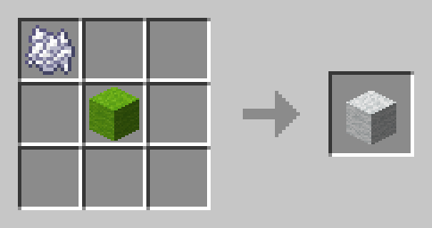
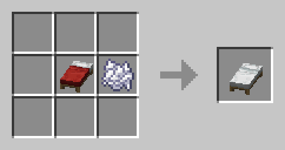

#### Brown Mushrooms

You can recover 4 brown mushrooms from a brown mushroom block.

#### Brown Mushroom Block

Crafted from 4 brown mushrooms.

#### Chainmail

Crafted using standard armor shapes, but with chains instead of iron ingots.

#### Clay

Four clay balls can be extracted from a clay block on a crafting table.

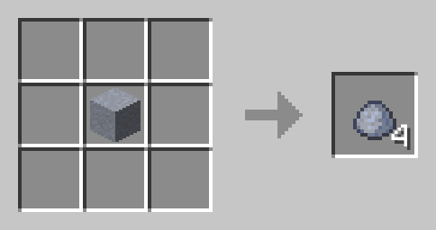

#### Cobweb

Crafted from 4 string and 1 slimeball. Yields 3 cobwebs.

#### Crying Obsidian

Crafted from 1 obsidian and 2 ghast tears.

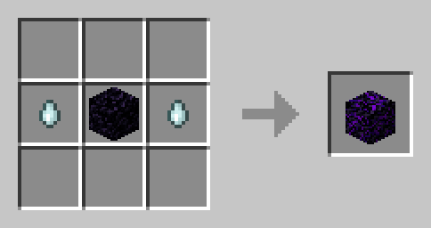

#### Cyan Dye

Craftable from 1 nether sprouts.

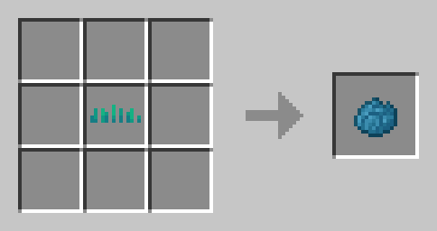

#### Dead Bush

Craftable from five sticks arranged in an X. Yields 2 dead bushes.

#### Elytra

Crafted from 3 sticks, 4 phantom membrane, and 1 iron nugget.

#### Enchanted Golden Apple

Crafted from 8 gold blocks and 1 golden apple.

#### Flow Banner Pattern

Crafted from 1 paper and 1 nautilus shell.

#### Globe Banner Pattern

Crafted from 1 paper and 1 eye of ender.

#### Guster Banner Pattern

Crafted from 1 paper and 1 breeze rod.

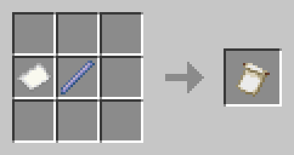

#### Leather

Craftable from cactus and poppy. In real life, they've developed a technique for creating leather from cactus and latex (of which poppies are a source).

You can still get leather from the usual sources.

#### Mushroom Stem

Crafted from 2 brown mushrooms and 2 red mushrooms

#### Name Tag

Crafted from 1 string and 1 paper. Yields 3 name tags.

#### Plant Cultivation

You can duplicate many overworld plants using 1 bonemeal above the plant
and 1 podzol below. (This is a shaped recipe.)

* Bamboo
* Big Dripleaf
* Cactus
* Fern
* Flowers
  * Allium
  * Azure Bluet
  * Blue Orchid
  * Cornflower
  * Dandelion
  * Eyeblossom
  * Glow Lichen
  * Lilac
  * Lily of the Valley
  * Orange Tulip
  * Oxeye Daisy
  * Pale Hanging Moss
  * Pale Oak Sapling
  * Peony
  * Pink Tulip
  * Poppy
  * Red Tulip
  * Rose Bush
  * Sunflower
  * Torchflower
  * White Tulip
  * Wither Rose
* Grass
* Large Fern
* Pitcher Plant
* Saplings
  * Acacia Sapling
  * Azalea
  * Birch Sapling
  * Cherry Sapling
  * Dark Oak Sapling
  * Flowering Azalea
  * Jungle Sapling
  * Mangrove Propagule
  * Oak Sapling
  * Spruce Sapling
* Small Dripleaf
* Tall Grass
* Vines

It is NOT possible to cultivate crops, mushrooms, aquatic plants,
nether plants, or end plants in this way.

#### Pale Moss Block

You can create two pale moss blocks from a stack of three pale moss carpets.

#### Pale Moss Carpet

You can craft pale moss carpet from a square of four pale hanging moss.

#### Purple Dye

Craftable from 1 sweet berries.

#### Red Mushrooms

You can recover 4 red mushrooms from a red mushroom block.

#### Red Mushroom Block

Crafted from 4 red mushrooms.

#### Red Sand

Crafted from 8 sand and 1 red dye (shapeless).

#### Saddle

Crafted from 4 leather and 2 iron ingots.

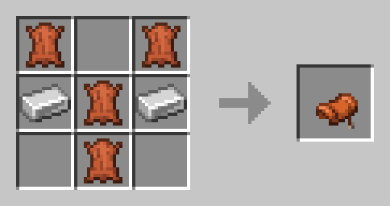

#### Snout Banner Pattern

Crafted from 1 paper and 1 piglin head.

#### Stone Cutter

You can now create the stonecutter using any of the following:

* Stone
* Andesite
* Deepslate
* Diorite
* Granite
* Polished Andesite
* Polished Basalt
* Polished Blackstone
* Polished Deepslate
* Polished Diorite
* Polished Granite
* Polished Tuff
* Smooth Basalt
* Smooth Stone
* Tuff

Naturally, the appearance of the stonecutter will not change depending on
the material you use.

#### White Banner/Bed/Carpet/Wool

See "Bleaching".

### Smelting & Blasting

#### Bottle o' Enchanting

Ever wonder how the clerics make those bottles of pure experience? Wonder
no more! You can make these too, by putting dragon breath in a furnace.
Quite a bit of extra experience also "leaks out" into the furnace itself,
so be sure you take it out yourself instead of using a hopper!

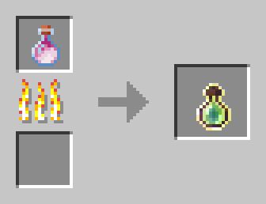

But of course, now we must wonder how the clerics get the dragon's breath...

#### Charcoal

Finally, a use for poisonous potatoes! Blasting a potato or poisonous potato
in a blast furnace makes charcoal.

This is based on an incident when I was 10, when I accidentally set a potato
on fire in the microwave, producing charcoal (and destroying the microwave). Oops!

#### Leather

You can smelt rotten flesh into leather.

#### Gold

It is now easier to recover gold from some items.

Smelting or blasting any of the following yields a gold nugget:

* Golden shovel
* Golden pickaxe
* Golden axe
* Golden hoe
* Golden sword
* Clock
* Gold Pressure Plate

Smelting or blasting any of the following yields a gold ingot:

* Golden helmet
* Golden chestplate
* Golden leggings
* Golden boots
* Golden horse armor
* Bell
* Totem of Undying
* Powered Rail

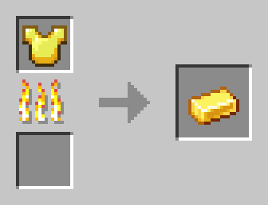
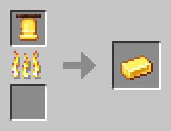

#### Iron

It is now easier to recover iron from some items.

Smelting or blasting any of the following yields an iron nugget:

* Iron shovel
* Iron pickaxe
* Iron axe
* Iron sword
* Shears
* Compass
* Flint and Steel
* Iron pressure plate

Smelting or blasting any of the following yields an iron ingot:

* Iron armor
* Chainmail armor
* Iron horse armor
* Iron door or trapdoor
* Cauldron
* Hopper
* Minecart
* Smithing Table
* Flint and Steel
* Chain
* Rail
* Detector Rail
* Activator Rail

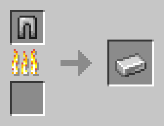

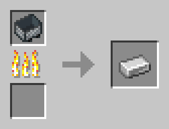
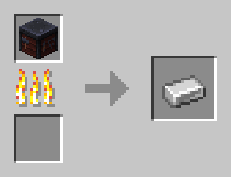

Smelting or blasting any anvil yields an iron block.

### Stonecutter

You can use the stonecutter to recover some resources.

#### Diamonds

Placing any diamond tool (except a shovel), armor piece, or jukebox on a
stonecutter yields one diamond; diamond horse armor yields three diamonds.

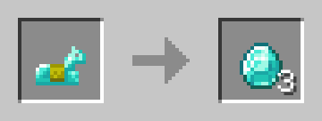

#### Leather Scraps

You can also recover one leather from any leather armor on the stonecutter;
you can get three leather from leather horse armor or a saddle.

#### Netherite

Placing any netherite tool or armor piece on a stonecutter yields two netherite scrap.

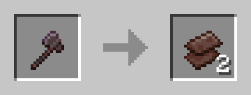
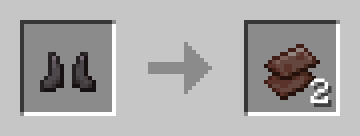

Placing a lodestone on a stonecutter yields one netherite ingot.

#### Slime Ball

You can recover a slime ball from magma cream by smelting off the blaze
powder.

